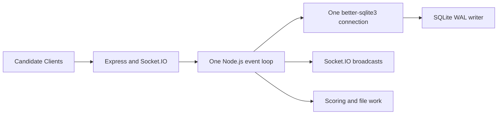

# Offline Center Server Concurrency Audit - 23 September 2026

**Status:** Source review. No numeric throughput or capacity claim is justified until the load tests in this document run on the intended server, clients, switch, and LAN.

## Executive Decision

The Center Server can maintain concurrent HTTP and Socket.IO connections, but its current processing model is **single-process, single-event-loop, and synchronous SQLite**. Concurrent requests do not execute database work in parallel. They queue behind synchronous JavaScript, `better-sqlite3` statements/transactions, paper generation, scoring, broadcasts, and filesystem work.

This is a reasonable starting design for a small offline center only after it is measured. It is not yet a demonstrated 25-, 50-, or higher-candidate delivery architecture.

## Concurrency Model

- Node.js can multiplex network connections while a callback yields.
- `better-sqlite3` calls are synchronous. A query, transaction, paper-generation loop, score-calculation loop, filesystem operation, or large JSON serialization blocks the event loop until it finishes.
- SQLite WAL allows readers alongside one writer, but it does not allow concurrent writers. All answer writes serialize through the same database connection and WAL writer.
- A slow or bursty synchronous path delays every candidate HTTP response, heartbeat, Socket.IO message, timer callback, and supervisor update handled by this Electron process.

## Actual Candidate Request Paths

| Path | Concurrency behavior | Current cost/risk |
| --- | --- | --- |
| Login | Serialized server work | Creates/updates an attempt, writes an event, then ensures a candidate paper. Simultaneous logins can build many papers on the event loop. |
| Paper load / recovery | Serialized read/JSON work | Loads paper, questions, options, and saved answers, then serializes the complete response. A login/reconnect wave can create a large read and network burst. |
| Answer save | Serialized write path | Validates attempt/paper/option, runs a transaction to upsert the answer and insert an event, then performs answer/paper counts. |
| Heartbeat / presence | Socket callback plus DB lookups | Normal candidate heartbeat re-registers socket identity and emits a server status update. |
| Monitor | Read aggregation | Candidate monitor uses joined aggregates and `COUNT(DISTINCT ...)`; frequent refreshes compete with candidate traffic. |
| Submission | Serialized CPU + write path | Loads paper/question/options, scores every saved answer, updates answers/attempt/candidate, and writes an event. |
| Deadline close | Serialized repeated submission | Iterates every active attempt and scores each one in sequence before closing the exam. |

## Findings

### P0: No measured concurrency budget or overload protection

There is no request-latency instrumentation, queue-depth metric, event-loop-delay metric, SQLite transaction duration, busy/locked-error count, or load-test harness for the normal candidate exam. Therefore the system cannot currently answer:

- How many concurrent answer saves meet the required p95/p99 latency.
- Whether a login wave causes candidate request timeouts.
- Whether retries amplify an outage into a server overload.
- Whether deadline auto-submit can complete before the service becomes unavailable.

**Required change:** add low-overhead metrics before claiming capacity. Record endpoint/status counts, in-flight requests, request duration histogram, event-loop delay, process CPU/RSS/heap, active sockets/attempts, SQLite write duration, WAL size, busy/locked errors, and retry/queue depth.

### P1: Synchronous paper generation creates a login-storm bottleneck

The login path calls paper creation when no paper exists. Paper generation loads all exam questions/options, orders them, and writes one `candidate_papers` row per question. If many candidates first log in together, this work runs repeatedly and synchronously on the only event loop.

**Impact:** the first wave of candidates can delay other logins, paper loads, answer saves, heartbeats, and supervisor controls. A client-side 10-second HTTP timeout can then produce retries and worsen the burst.

**Required change:** pre-generate papers before opening candidate login, or prepare them in controlled batches with progress/health feedback. Keep candidate login limited to authorization, device binding, and retrieval of an already prepared paper. Validate an explicit “all papers ready” gate before starting an exam.

### P1: Global broadcasts produce avoidable $O(N^2)$ traffic

After every answer save, the server uses a global Socket.IO emit for `candidate_progress_updated`. At $N$ active candidates, if each saves $Q$ answers, this can send approximately $N \times Q \times N$ message deliveries, including to candidate clients that do not need other candidates' progress.

The server also emits global `server:status` updates on client registration, reconnect, disconnect, and submission.

**Impact:** CPU, serialization, WebSocket bandwidth, and renderer work increase with all connected sockets rather than with supervisor/admin listeners. This is most visible during synchronized answer or login bursts.

**Required change:** separate Socket.IO rooms by role and exam. Send candidate progress and aggregate monitor updates only to authenticated supervisor/admin monitor rooms. Send candidate-specific controls only to the candidate's socket or attempt room. Throttle/coalesce server-status snapshots rather than emitting one per connection event.

### P1: Deadline auto-submit is an event-loop blocking burst

At deadline, the one-second timer calls `closeExam`. It enumerates all active attempts and auto-submits them sequentially. Each auto-submit scores answers, updates answer rows, updates attempt/candidate rows, and writes events before the next candidate is processed.

**Impact:** $N$ candidates reaching deadline together creates a single synchronous CPU/database burst. During this period, late saves, client retries, Socket.IO heartbeats, and UI control messages are delayed. It also makes timeout behavior depend on loop duration rather than an explicit bounded work plan.

**Required change:** define a deadline-close strategy that keeps the database authoritative without doing all scoring on the critical timer callback. In one short transaction, mark attempts closed and preserve their accepted answer cutoff. Score in bounded batches or a supervised background phase after closure. Emit one aggregated close event and targeted candidate terminal messages, not one global event per attempt.

### P1: Retry behavior can create a thundering herd

The Candidate Client retries pending answers every 1.5 seconds after a failed save, and every client can do so at the same interval. The server has no explicit normal-exam request admission control, retry hint, per-attempt rate limit, or backpressure response.

**Impact:** a brief server/LAN pause can become repeated synchronized save/health-check requests from all candidates. That prevents the server from clearing the original queue promptly.

**Required change:** use bounded exponential backoff with jitter on clients, honor `Retry-After` or a server-provided retry delay, enforce a small per-attempt in-flight save limit, and return explicit overload/backpressure responses. Retain idempotency for duplicate answer saves.

### P2: SQLite is configured for WAL but lacks an explicit operational contention policy

The server enables `journal_mode = WAL` and foreign keys, which is appropriate. The code does not set or report `busy_timeout`, checkpoint policy, synchronous durability mode, cache sizing, WAL checkpoint duration, or SQLite busy/locked errors.

**Impact:** a concurrent writer, antivirus/backup interaction, disk pressure, or long checkpoint can surface as immediate failures or unknown latency rather than controlled queuing and diagnosable evidence.

**Required change:** set and document a conservative `busy_timeout`; collect SQLite error codes and transaction durations; sample WAL size; checkpoint outside high-traffic windows or under a bounded policy; ensure the database and WAL reside on supported local SSD storage excluded from aggressive on-access scanning according to center policy.

### P2: Monitor queries and status recomputation share the exam critical path

Monitor queries aggregate candidate papers and answers with joins and distinct counts. Status updates query imported exams and attempt counts. These run in the same process/connection as answer saves and can be triggered frequently by UI polling and socket events.

**Impact:** supervisor observation can degrade candidate delivery precisely when activity is highest.

**Required change:** throttle monitor refresh, publish coalesced aggregate snapshots, maintain lightweight counters from write events where safe, and keep detailed candidate tables on an explicit operator refresh cadence. Benchmark monitor-open and monitor-closed scenarios separately.

### P2: Synchronous export/file work must remain outside active delivery

Result export reads full result sets, serializes JSON/CSV, hashes content, and writes files synchronously. This is currently restricted to closed exams, which is appropriate; preserve that exclusion and ensure exports/uploads cannot overlap an active official exam.

## Recommended Delivery Sequence

1. **Instrument before optimizing:** endpoint latency, event-loop delay, SQLite timings/errors, active sockets, retry counts, WAL/disk/process metrics.
2. **Remove avoidable fan-out:** supervisor/admin Socket.IO rooms, candidate-specific delivery, coalesced status/progress updates.
3. **Eliminate live paper generation:** pre-generate and verify papers before candidate login opens.
4. **Add admission control:** per-attempt save serialization, bounded client retry with jitter, server backpressure response, and idempotent save semantics.
5. **Rework deadline closure:** fast authoritative close first; bounded/asynchronous scoring second; test worst-case all-candidate expiry.
6. **Tune and observe SQLite:** `busy_timeout`, WAL growth/checkpoint evidence, durable storage policy, and a contention test.
7. **Run progressive capacity tests:** 1, 5, 10, 15, 20, 25, then each intended tier with realistic and synchronized worst-case traffic.

## Required Test Matrix

| Scenario | Expected evidence |
| --- | --- |
| Simultaneous login/paper load | all papers prepared within target time; no client HTTP timeout; event-loop p95 stays within limit |
| Paced answer saves | answer-save p50/p95/p99, server CPU/RSS, SQLite write time, WAL size, no lost/duplicate answers |
| Synchronized answer burst | same metrics under all clients saving within the same short interval |
| Brief server/LAN pause | bounded retry rate, recovery time, queue depth, no lost/duplicated durable answers |
| Supervisor monitor open | compare candidate save latency with monitor polling/subscriptions on and off |
| All-candidate deadline | closure time, accepted-answer cutoff, scoring completion, terminal delivery, no event-loop stall beyond limit |
| Server restart | paper/session recovery, duplicate-save handling, server-authoritative deadline, final submission recovery |

## Capacity Acceptance Gate

For every target tier, retain a versioned evidence bundle containing server/client builds, hardware/LAN details, exam package hash, active-candidate curve, request rates, p50/p95/p99 latencies, event-loop delay, CPU/RSS/heap, SQLite/WAL/disk metrics, retry/error counts, socket delivery metrics, and closure duration.

Approve a tier only when all candidates can log in with pre-generated papers, save answers within the agreed p95/p99 limit, recover from the tested transient outage, and complete/auto-close without unexplained loss, duplicate persistence, timeout, or supervisory control delay. The target must retain operational headroom; a one-time peak that reaches host or event-loop saturation is not a capacity certification.
