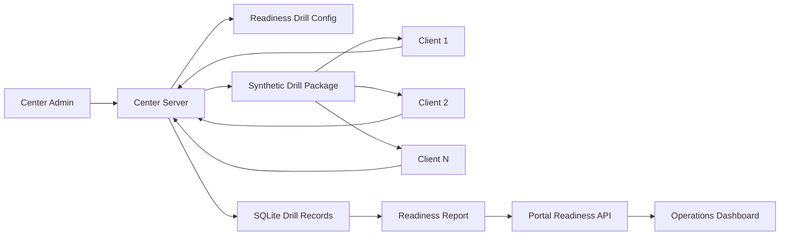

# Center Autoboot Readiness Drill Plan

**Status:** Proposed implementation specification
**Date:** 18 September 2026
**Scope:** AlignEx Center Server, Candidate Client, center readiness reporting, and portal operations

## 1. Purpose

The Center Autoboot Readiness Drill is a controlled test used to prove that a CBT center is ready to conduct a large examination before the real exam day.

The drill verifies that:

- The Center Server is installed and activated.
- Candidate client devices can discover and connect to the server.
- The local network can sustain the expected client load.
- The server can start an exam and control time.
- Clients can receive questions and submit answers automatically.
- The SQLite database can persist attempts and events under load.
- The server can close the drill and generate a complete readiness report.
- The report can be uploaded to the AlignEx platform.

This is a **readiness test**, not a candidate examination. It must never create official candidate results, certificates, recruitment decisions, or released scores.

## 2. Critical Safety Boundary

Autoboot must be implemented as a separate `readiness_drill` mode. It must not silently modify the normal candidate exam workflow.

The drill must use one of these safe identities:

1. **Synthetic clients and synthetic candidates**, recommended for the first implementation.
2. **Clearly flagged test clients and test candidates**, never real candidates.
3. A dedicated readiness package containing generated test identities and questions.

The drill must not:

- Auto-answer a live candidate exam.
- Use real candidate registration numbers.
- Write into official result tables.
- Affect candidate attendance or eligibility.
- Use the real exam code.
- Reuse a production package without an explicit readiness transformation.
- Return answer keys to ordinary clients.
- Allow a readiness report to be mistaken for an official result batch.

## 3. Proposed User Workflow

### 3.1 One-time center preparation

1. Install the Center Server.
2. Activate it with the center's authorized activation code.
3. Install the Candidate Client on the expected client computers.
4. Connect all clients to the Center Server LAN address.
5. Enable or select **Autoboot Readiness Mode** in Center Server settings.
6. Confirm the server identity, center identity, device count, and expected client count.

### 3.2 Create a readiness drill

The server administrator selects **Create Autoboot Drill** and configures:

- Drill name.
- Number of subjects.
- Questions per subject.
- Duration.
- Expected client count.
- Start delay or scheduled start time.
- Answer strategy.
- Whether clients should answer all questions, answer a percentage, or deliberately inject controlled failures.
- Network heartbeat interval.
- Maximum allowed client reconnects.
- Report upload destination.

The server creates the drill locally. It does not create an official exam.

The drill must use a Super Admin-managed readiness package selected for one of the supported live capacity tiers: **15, 25, 50, 100, 150, 200, or 250 candidates**. Autoboot runs at the selected capacity plus a 15% synthetic backup, rounded up:

$$
	ext{Autoboot clients} = \left\lceil \text{capacity} \times 1.15 \right\rceil
$$

The resulting Autoboot targets are 18, 29, 58, 115, 173, 230, and 288 clients respectively. The selected package, capacity, backup percentage, and calculated target must be frozen in the drill before clients are started.

### 3.3 Start the drill

1. The administrator reviews the connected-client list.
2. The server records a connection snapshot.
3. The administrator confirms the expected client count.
4. The server broadcasts a drill-start command.
5. Connected readiness clients automatically register synthetic identities.
6. The server creates synthetic attempts.
7. Clients receive the drill paper and begin automatically.
8. Each client displays its time progress and automatic answer activity.
9. Clients submit automatically when their test sequence completes or the timer expires.
10. The server closes the drill and produces a readiness report.

### 3.4 Report submission

The administrator reviews the report locally, then chooses **Upload Readiness Report**.

The portal stores the report as operational evidence. It must not place the data in official candidate result tables.

## 4. Architecture



## 5. Components

### 5.1 Center Server

The server owns:

- Drill configuration.
- Client discovery and registration.
- Connection snapshots.
- Synthetic candidate generation.
- Drill start/stop state.
- Timer authority.
- Question delivery.
- Automated response validation.
- Local event logging.
- Drill result aggregation.
- Report creation and upload.

### 5.2 Readiness Client

The client may reuse the Candidate Client shell, but it must enter an explicit readiness mode based on a signed drill manifest.

The client must display:

- `READINESS TEST` or equivalent unmistakable label.
- Center name.
- Drill name.
- Client identity.
- Connection status.
- Current question or automated activity.
- Time remaining.
- Answer progress.
- Submission state.
- Failure/reconnect state.

The client must not display the drill as an official candidate examination.

### 5.3 Portal

The portal owns:

- Center readiness drill authorization.
- Report ingestion.
- Report history.
- Center readiness status.
- Comparison across centers.
- Operational alerts.
- Readiness approval or failure decision.

## 6. Drill Modes

### 6.1 Synthetic full run

Every connected client answers every assigned question using a deterministic test strategy and submits successfully.

Purpose:

- Validate the normal happy path.
- Measure throughput and timing.
- Confirm all clients complete.

### 6.2 Network resilience run

A controlled subset of clients disconnects and reconnects during the drill.

Purpose:

- Verify reconnect handling.
- Verify answer retry behavior.
- Measure lost or delayed responses.

### 6.3 Partial failure run

A controlled subset of clients reports failures such as:

- Delayed response.
- Intentional reconnect.
- Local storage write delay.
- Client shutdown and restart, where supported.

Purpose:

- Confirm the center can identify failures.
- Confirm one failed client does not corrupt the whole drill.
- Verify recovery and incident reporting.

### 6.4 Capacity run

The drill uses the expected maximum number of connected clients and expected answer-save frequency.

Purpose:

- Measure server CPU, RAM, SQLite writes, LAN traffic, latency, and completion rate.
- Confirm the center meets its planned capacity.

### 7. Question Bank and Capacity Packages

The server must import an approved readiness package from the Super Admin-managed package catalog. A package is selected by capacity profile rather than embedded as one fixed default. Each package must contain:

- Four subjects.
- Twenty-five questions per subject.
- At least 100 total questions.
- Multiple-choice questions with two or more options.
- A mixture of short and normal question text.
- Known expected answer distribution for test validation.
- No real examination questions.
- No confidential or copyrighted production content unless properly authorized.

Each package must be versioned, checksummed, and validated before use. Example metadata:

```text
alignex.readiness-pack.v1-250
capacity_profile: 250
subjects: package-defined
total_questions: package-defined
autoboot_target_clients: 288
```

The package must declare its capacity profile, question count, subject map, schema version, and SHA-256 checksum. The content pack must be immutable once a drill starts. Updating the package creates a new package version.

## 8. Drill Data Model

The local Center Server should add separate tables or equivalent storage for readiness data.

### `readiness_drills`

- `id`.
- `name`.
- `status`: draft, ready, running, completed, failed, uploaded.
- `mode`: synthetic_full, network_resilience, partial_failure, capacity.
- `content_pack_version`.
- `capacity_profile`.
- `backup_percent`.
- `autoboot_target_clients`.
- `duration_seconds`.
- `expected_clients`.
- `connected_clients_at_start`.
- `started_at`.
- `closed_at`.
- `created_by`.
- `report_hash`.
- `upload_status`.
- `created_at`, `updated_at`.

### `readiness_clients`

- `id`.
- `drill_id`.
- `client_id`.
- `device_fingerprint`.
- `display_name`.
- `ip_address`.
- `user_agent`.
- `connected_at`.
- `last_heartbeat_at`.
- `disconnected_at`.
- `status`.
- `reconnect_count`.
- `error_count`.

### `readiness_attempts`

- `id`.
- `drill_id`.
- `client_id`.
- `status`: prepared, active, submitted, timed_out, failed.
- `started_at`.
- `submitted_at`.
- `answered_count`.
- `total_questions`.
- `score` as diagnostic evidence only.
- `latency_average_ms`.
- `error_count`.

### `readiness_events`

- `id`.
- `drill_id`.
- `client_id` nullable.
- `event_type`.
- `severity`.
- `message`.
- `metadata`.
- `occurred_at`.

### `readiness_reports`

- `id`.
- `drill_id`.
- `center_id`.
- `activation_id`.
- `report_version`.
- `payload_hash`.
- `status`.
- `uploaded_at`.
- `portal_receipt_id`.
- `created_at`.

Readiness tables must not be reused as official candidate exam tables.

## 9. Client Connection Protocol

### 9.1 Registration

A readiness client connects using Socket.IO or the existing local connection mechanism and sends:

```json
{
  "mode": "readiness_drill",
  "client_id": "stable-client-id",
  "device_fingerprint": "hashed-device-fingerprint",
  "client_version": "0.1.0",
  "capabilities": {
    "local_storage": true,
    "websocket": true,
    "http": true
  }
}
```

The server returns a signed or authenticated readiness session token.

### 9.2 Heartbeat

Each connected client sends periodic heartbeats. The server records:

- Last heartbeat.
- Round-trip time.
- Connection count.
- Reconnect count.
- Current drill phase.
- Current question index.
- Answer-save queue length.

A client is considered disconnected after a configurable heartbeat timeout.

### 9.3 No automatic real-exam login

The readiness client must not call the normal candidate login endpoint with a real registration number. It must use a dedicated readiness protocol and synthetic identity.

## 10. Autoboot Drill State Machine

```text
idle
  -> configuring
  -> ready
  -> collecting_clients
  -> client_snapshot_locked
  -> starting
  -> running
  -> closing
  -> report_ready
  -> upload_pending
  -> uploaded
```

Failure states:

```text
ready -> failed
collecting_clients -> failed
running -> interrupted
upload_pending -> upload_failed
```

Rules:

- Only one readiness drill may run at a time.
- A live official exam and readiness drill cannot run simultaneously on the same server.
- The administrator must confirm the expected client count before start.
- The client list is frozen when the drill starts.
- Clients connecting after the snapshot are not silently added.
- The drill can be stopped by an authorized administrator.
- Stopping a drill produces an incomplete report rather than an official result.

## 11. Automated Answer Behavior

The automated answer strategy must be deterministic and configurable.

Recommended strategies:

- `first_option`: choose the first valid option.
- `correctness_probe`: use only in a server-controlled synthetic test where the expected answer is part of private test metadata, never sent to ordinary clients.
- `patterned`: choose a repeatable option pattern to exercise storage and scoring paths.
- `random_seeded`: choose a deterministic pseudo-random option using the drill seed.

The client should:

1. Receive the next question.
2. Display the question and progress.
3. Wait the configured simulated reading time.
4. Select the configured answer.
5. Submit the answer.
6. Wait for server acknowledgement.
7. Move to the next question.
8. Submit the synthetic attempt at completion or timeout.

The server remains authoritative for question order, allowed options, time, acknowledgement, and submission. The client cannot set its own score or completion status.

## 12. Time and Progress UI

The readiness client must show:

- Drill timer.
- Questions completed / total.
- Current subject.
- Answer-save status.
- Server connection status.
- Reconnect count.
- Submission status.
- Clear readiness-test watermark.

The timer must be based on the server-issued start time and deadline. The client display is informational and must not determine completion.

## 13. Readiness Report

The report must answer whether the center is operationally ready, not whether candidates passed an exam.

### 13.1 Summary metrics

- Drill ID and report version.
- Center identity.
- Server device and activation identity.
- Server application version.
- Content pack version.
- Expected clients.
- Connected clients at snapshot.
- Clients completed.
- Clients failed.
- Clients disconnected.
- Total questions processed.
- Total answers acknowledged.
- Total submissions.
- Answer-save success rate.
- Submission success rate.
- Average and p95 answer acknowledgement latency.
- Average and p95 submission latency.
- Maximum reconnect count.
- Server CPU and memory samples.
- SQLite write and error counts.
- Drill duration.
- Report checksum.

### 13.2 Center readiness decision

The portal or operations team may classify the center as:

- `ready`.
- `ready_with_warnings`.
- `not_ready`.
- `needs_retest`.
- `manual_review`.

The decision must be based on configurable thresholds, not only a boolean client completion result.

Example starting thresholds:

- At least 95% of expected clients connected at snapshot.
- At least 98% of connected clients completed successfully.
- Answer acknowledgement success at least 99%.
- No unexplained database write errors.
- No client with unresolved state.
- p95 answer latency below the approved center threshold.
- All clients able to receive the complete question pack.

Thresholds must be configurable per project and center capacity tier.

## 14. Portal Report Upload

Use a dedicated endpoint and model, not the official result-upload endpoint:

```text
POST /api/offline/readiness-reports
GET  /api/offline/readiness-reports/{id}
POST /api/offline/readiness-reports/{id}/retry
```

The upload must include:

- Center activation and device identity.
- Drill ID.
- Report version.
- Content pack version.
- Payload hash.
- Signed or authenticated report envelope.
- Client and attempt summaries.
- Aggregated metrics.
- Events required for investigation.

The portal must validate:

- Active or recently valid center activation.
- Center ownership.
- Report idempotency.
- Payload integrity.
- Drill identity.
- Application and content-pack compatibility.

The portal must store readiness reports separately from:

- Candidate result tables.
- Official attempts.
- Certificates.
- Recruitment scores.
- Public candidate results.

## 15. Security Rules

- Readiness mode must be explicit in the package and every client session.
- The server must reject readiness clients during a live official exam.
- Official clients must reject readiness commands.
- Synthetic identities must be visibly marked and non-production.
- Readiness reports must never be eligible for candidate result release.
- Only authorized center administrators may create or start a drill.
- Only authorized operations users may mark a center ready.
- Drill packages must be signed or authenticated.
- Client IDs and device fingerprints should be hashed or minimized in portal reports.
- Do not include passwords, activation codes, answer keys, or reusable license secrets in reports.
- Every start, stop, client registration, disconnect, answer, submission, and upload must be audited.

## 16. Failure Handling

### Client cannot connect

Record the client as missing or failed. Do not wait indefinitely. The administrator may cancel and restart the drill after correcting the client.

### Client disconnects during the drill

Keep its attempt state. Allow reconnect within the configured grace period. Mark unresolved clients clearly in the report.

### Answer acknowledgement fails

Retry with an idempotency key. Do not count an answer as accepted until the server acknowledges it.

### Server restart

Persist the drill state and recover as `interrupted` or `resumable` according to policy. Do not silently mark all clients successful.

### Insufficient storage

Stop starting the drill, preserve the failure evidence, and show an administrator action state.

### Report upload fails

Keep the immutable local report and retry later. The center can still view the local report while upload is pending.

### Partial success

Generate a report even when some clients fail. Do not discard successful client evidence.

## 17. Recommended UI Screens

### Center Server

- Readiness overview.
- Create drill.
- Connected clients.
- Drill configuration.
- Start confirmation.
- Live drill monitor.
- Drill report.
- Upload and retry status.
- Historical drill reports.

### Candidate Client

- Readiness-test connection screen.
- Automatic drill screen.
- Timer and progress.
- Connection state.
- Submission confirmation.
- Completed readiness state.

### Portal

- Center readiness dashboard.
- Project readiness overview.
- Center drill history.
- Report details.
- Threshold configuration.
- Manual review and approval.
- Retest scheduling.

## 18. Implementation Order

### Phase 1: Containment and contracts

1. Add `readiness_drill` mode constants and feature flags.
2. Add separate local readiness tables.
3. Define signed drill manifest and report contract.
4. Add official-exam rejection of readiness clients and commands.
5. Add unit tests for mode isolation.

### Phase 2: Client presence and synthetic identities

1. Extend existing Socket.IO presence registration with explicit mode.
2. Add stable readiness client IDs.
3. Add heartbeat, connection snapshot, and reconnect tracking.
4. Add client-version and capability reporting.
5. Add connected-client management UI.

### Phase 3: Drill execution

1. Add built-in four-subject readiness content pack.
2. Add drill configuration and validation.
3. Add start confirmation and client snapshot freeze.
4. Add automated question/answer protocol.
5. Add server-authoritative timer and close behavior.
6. Add live progress monitoring.

### Phase 4: Reporting

1. Add local report aggregation and checksum.
2. Add report UI and export.
3. Add portal readiness-report tables and APIs.
4. Add upload retry and idempotency.
5. Add center readiness thresholds and status.

### Phase 5: Scale validation

1. Load-test four subjects and 100 questions across expected client counts.
2. Test reconnect storms.
3. Test SQLite write pressure.
4. Test server restart and report recovery.
5. Test simultaneous center report uploads.
6. Rehearse on representative center hardware.

## 19. Acceptance Tests

### Mode isolation

- A readiness client cannot log into a normal official exam.
- An official candidate client cannot receive readiness commands.
- Readiness attempts never appear in official result queries.
- Readiness reports cannot be released as candidate results.

### Connection and start

- All connected clients appear in the snapshot.
- Late clients are rejected or marked late according to policy.
- The drill cannot start below the minimum client threshold unless explicitly overridden.
- Only one drill can run at a time.

### Automated execution

- Every participating client receives the correct subject/question sequence.
- The timer is server-authoritative.
- Answer acknowledgements are idempotent.
- Clients retry failed answer saves.
- Completed clients submit automatically.
- A disconnected client is marked accurately.

### Reporting

- The report contains expected, connected, completed, failed, and disconnected counts.
- Latency and error metrics are calculated correctly.
- The report checksum is stable.
- Upload retries do not create duplicate reports.
- The portal stores the report outside official result tables.

### Security

- Unauthorized administrators cannot create or start drills.
- The content pack cannot be replaced silently.
- Reports do not contain passwords, activation codes, or answer keys.
- Drill data is scoped to the activated center.

## 20. Recommended First Release

The first implementation should deliberately be narrow:

- Traditional fixed-question readiness content only.
- Four built-in subjects and 25 questions per subject.
- Synthetic clients only.
- One Center Server at a time.
- One drill at a time per server.
- LAN-only execution after package preparation.
- Explicit start confirmation.
- Automatic answer and submission behavior.
- Local report plus portal upload.
- No interaction with official candidate result tables.
- No adaptive scoring.
- No real candidate identities.

The project should not proceed to live mass-exam automation until the readiness drill can demonstrate stable behavior at the expected center capacity.

## 21. Final Operating Summary

```text
Install and activate Center Server
  -> install and connect readiness clients
  -> enable readiness drill mode
  -> create synthetic four-subject drill
  -> verify connected-client snapshot
  -> freeze client list
  -> start drill
  -> clients receive questions automatically
  -> clients answer and submit automatically
  -> server closes and aggregates evidence
  -> generate immutable readiness report
  -> upload report to portal
  -> operations classify center readiness
  -> approve center for the real exam
```

The core boundary is: **autoboot validates the center's technical readiness; it must never impersonate a real candidate examination or create official results.**
