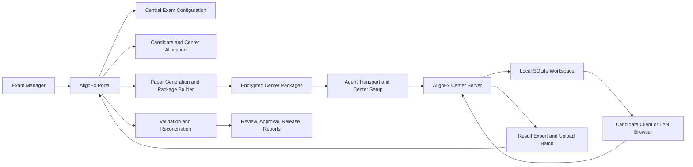

# Mass-Scale CBT Project Implementation Plan

**Status:** Proposed implementation specification
**Date:** 18 September 2026
**Platform:** AlignEx Portal, AlignEx Center Server, Candidate Client
**Primary use case:** Large examinations with thousands of candidates distributed across many registered CBT centers.

## 1. Purpose

This document defines the operating model and implementation plan for a large-scale computer-based test in which:

1. The examination is created and configured centrally on AlignEx.
2. Candidates are posted to approved CBT centers.
3. Each center receives a controlled exam package.
4. An assigned field agent transports, installs, activates, and operates a Center Server at the center.
5. Candidates write the exam locally under server-controlled rules.
6. Results and audit evidence are returned to the AlignEx platform.
7. Administrators reconcile, review, approve, and release results.

The design supports thousands of candidates across many centers while preserving tenant isolation, paper integrity, offline operation, result traceability, and operational recovery.

This is an implementation plan, not a promise that every capability is already implemented. Existing capabilities are identified separately from proposed work.

## 2. Guiding Principles

1. The portal is the source of truth for exam configuration, candidate eligibility, center allocation, paper generation, scoring policy, result release, and audit state.
2. A Center Server is a controlled execution site, not an independent exam authority.
3. Every center package is bound to one exam, one center allocation, one activation, and one package version.
4. Candidate data is scoped to the assigned center and must never leak between centers.
5. The server must continue a prepared exam during temporary internet loss, but it must not invent eligibility, questions, scores, or result acceptance.
6. Results are accepted only after portal-side validation, replay protection, paper verification, and authorization checks.
7. Deactivation, device transfer, and agent changes must preserve data and audit history.
8. No single center failure may corrupt the central exam or prevent other centers from completing.
9. Operational dashboards must show center-level readiness, not only overall exam status.
10. Capacity, timing, integrity, and recovery must be tested with production-scale data before a live examination.

## 3. Existing AlignEx Foundation

The repository already contains relevant building blocks:

- Central Laravel/MySQL exam and candidate management.
- Organization, institution, and CBT-center ownership contexts.
- Candidate paper generation with stored question and option order.
- Electron + SQLite Center Server.
- Offline activation codes and device-specific activations.
- Server-side activation guard and device binding.
- Offline exam package export and local import.
- Local candidate delivery, answer capture, monitoring, and result export.
- Durable local upload queues and portal-side result receipts.
- Portal reconciliation of local evidence and official marks.
- Device reset and activation management.
- Deactivation policy covering local workspaces and tenant switching.

The current traditional fixed-paper offline workflow is the safest initial delivery mode for this project. Adaptive offline delivery must remain separately controlled until its synchronization, scoring, and recovery contracts are accepted.

## 4. Terminology

### 4.1 Project

The business examination event, such as a national recruitment test, professional qualifying examination, or institution-wide admission examination.

### 4.2 Exam

The configured examination definition: title, category, mode, duration, rules, blueprint, scoring, schedule, security settings, and result policy.

### 4.3 Exam sitting

A scheduled delivery instance of an exam. A project may have one sitting or multiple sittings for different dates, shifts, or candidate cohorts.

### 4.4 Center allocation

The assignment of a group of candidates to one registered CBT center for one sitting. It includes center capacity, reporting window, seat plan, package version, supervisor assignment, and operational status.

### 4.5 Center package

The authenticated, encrypted package containing only the data required for one center allocation to deliver one exam sitting.

### 4.6 Agent

An authorized field or operations worker assigned to prepare, transport, activate, support, or close a center server. An agent is not automatically allowed to access candidate results or change exam configuration.

### 4.7 Center workspace

The local SQLite data area for one center allocation and activation. It must remain isolated from other tenants, allocations, and historical workspaces.

### 4.8 Result batch

A bounded upload unit containing completed local attempts, answer evidence, audit events, package identity, and upload metadata for one center allocation.

## 5. High-Level Architecture



### 5.1 Central portal

Laravel/MySQL owns:

- Project and exam configuration.
- Candidate registration and eligibility.
- Center registry and capacity.
- Center allocation and seat assignment.
- Paper generation and immutable package versions.
- Agent assignments and operational permissions.
- Activation and device authorization.
- Result ingestion, validation, reconciliation, review, and release.
- Audit events and operational dashboards.

### 5.2 Center Server

Electron + SQLite owns:

- Activation and local workspace state.
- Receipt and verification of the assigned package.
- Local candidate and seat delivery.
- Server-controlled timing and exam state.
- Answer capture and local audit events.
- Supervisor and agent operational views.
- Encrypted result batch creation.
- Retry-safe upload and receipt handling.

### 5.3 Candidate client

The candidate-facing client must receive only:

- Candidate identity needed for the session.
- Exam instructions and timing.
- Assigned question text and allowed options.
- Candidate progress and submission state.

It must never receive answer keys, correctness flags, scoring rubrics, or other candidates' data.

## 6. Project and Exam Lifecycle

```text
Draft Project
  -> Exam Configuration
  -> Center and Capacity Planning
  -> Candidate Eligibility and Posting
  -> Paper Generation
  -> Center Package Release
  -> Agent Dispatch
  -> Center Readiness
  -> Exam Sitting
  -> Local Close and Result Export
  -> Portal Upload
  -> Validation and Reconciliation
  -> Result Review
  -> Result Release
  -> Project Closure and Archive
```

Every transition must be explicit, authorized, timestamped, and audited. A later phase must not silently mutate an earlier immutable phase.

## 7. Phase 1: Exam Setting and Configuration

### 7.1 Exam identity

An exam must have:

- Project ID.
- Exam ID and immutable public code.
- Exam title and organization/institution owner.
- Category and delivery mode.
- Sitting or session identity.
- Version number.
- Status: draft, ready, scheduled, active, completed, cancelled, archived.
- Created by, reviewed by, approved by, and timestamps.

### 7.2 Exam settings

The exam manager configures:

- Duration and server-authoritative start/end windows.
- Reporting and admission windows.
- Candidate login policy.
- Number of permitted attempts.
- Question and paper rules.
- Candidate navigation policy.
- Answer save policy.
- Auto-submit policy.
- Pass mark and scoring rules.
- Negative marking, if approved for the exam.
- Randomization policy.
- Center delivery mode.
- Supervisor and anti-cheating controls.
- Result release policy.
- Offline export eligibility.
- Package expiry and allowed center list.

Configuration must be validated before publication. Changes after package generation must create a new exam/package version; they must not silently change already-issued papers.

### 7.3 Question readiness

Before package generation:

- Questions must be approved according to the question workflow.
- Required banks, subjects, courses, and topics must have sufficient inventory.
- Marks and option structures must be consistent.
- Correct answer keys remain server-side only.
- Paper generation must be deterministic and auditable.
- The generated paper version receives a content hash.

## 8. Phase 2: Candidate Registration and Posting

### 8.1 Candidate data

Candidate records should include:

- Central candidate ID.
- Registration number or exam number.
- Full name.
- Contact and notification fields where required.
- Eligibility status.
- Exam/project membership.
- Assigned sitting.
- Assigned center.
- Candidate group or cohort.
- Special accommodation flags with restricted visibility.
- Candidate status and audit timestamps.

Sensitive identity fields must be minimized in center packages. A center receives only candidates assigned to that center and sitting.

### 8.2 Center allocation algorithm

The allocation service should support:

- Manual allocation by administrators.
- Bulk allocation by region, state, institution, or candidate group.
- Capacity-aware automatic allocation.
- Reserved seats and accommodation capacity.
- Center blackout dates.
- Candidate distance or preference rules where available.
- Center equipment capacity.
- Shift and session balancing.
- Reallocation before package freeze.

The allocation service must reject:

- Duplicate active allocation for the same candidate and sitting.
- Allocation to an inactive or unapproved center.
- Allocation beyond available capacity.
- Allocation without required center equipment or supervisor capacity.
- Cross-project or cross-tenant candidate leakage.

### 8.3 Allocation freeze

Before package generation, the allocation is frozen:

- Candidate-to-center assignments become read-only for that release.
- Changes require an amendment or a new package version.
- The portal records the allocation hash.
- The center package includes the allocation version.
- Reassigned candidates are handled through explicit transfer or replacement records.

## 9. Phase 3: Center Preparation

### 9.1 Center readiness requirements

Each center must have:

- Approved active center record.
- Named center administrator.
- Named supervisor or proctor team.
- Sufficient computers and network capacity.
- Stable LAN or approved local connectivity.
- One authorized Center Server device or approved device pool.
- Power backup plan.
- Candidate registration and attendance process.
- Secure location for server and backups.
- Communication channel to the operations team.
- Completed readiness checklist.

### 9.2 Agent dispatch

The portal assigns an agent to one or more center allocations. The dispatch record must include:

- Agent identity and role.
- Center allocation.
- Device ID or server asset tag.
- Package version and hash.
- Activation code or secure activation handoff reference.
- Pickup time and destination.
- Chain-of-custody status.
- Expected arrival and setup window.
- Support contact.
- Return or archive instructions.

Agents may install and verify the assigned package, but must not change exam settings, answer keys, candidate allocation, or result policy.

### 9.3 Server preparation

At the center, the agent must:

1. Verify the physical device and asset tag.
2. Confirm the correct center and sitting.
3. Activate the server with authorized credentials.
4. Verify the activation scope and expiry.
5. Import the assigned package.
6. Verify package hash, exam identity, center identity, candidate count, and paper count.
7. Run the local health check.
8. Test candidate client connectivity.
9. Test supervisor access.
10. Verify time synchronization and local clock policy.
11. Confirm backup storage and recovery media.
12. Record readiness evidence and sign off.

The server must reject a package if its center, sitting, activation, version, or hash does not match the expected allocation.

## 10. Center Package Contract

Each package must contain an authenticated manifest with:

- Package contract version.
- Project ID.
- Exam ID.
- Sitting ID.
- Center allocation ID.
- Center ID and tenant identity.
- Package ID and version.
- Created and expires timestamps.
- Paper generation version.
- Allocation hash.
- Content hash.
- Candidate count.
- Expected seat count.
- Required application version.
- Allowed device or activation binding.
- Signature or authenticated integrity proof.

Package payload may include:

- Assigned candidates.
- Candidate login material or securely derived access credentials.
- Candidate papers and question order.
- Allowed options without correctness flags.
- Marks required for local display only where safe.
- Exam instructions.
- Seat and session information.
- Center-specific settings.
- Required proctoring rules.

Package payload must not include:

- Answer keys in candidate-readable content.
- Other center candidates.
- Unassigned question banks.
- Hidden scoring rules not required by the local server.
- Portal credentials or activation codes in plain text.
- Data from another project, exam, sitting, or tenant.

## 11. Phase 4: Exam-Day Operation

### 11.1 Center opening

The supervisor opens the sitting using the Center Server. The server verifies:

- Active package.
- Active device/license.
- Center and sitting identity.
- Current time and permitted window.
- Candidate roster.
- Local server health.
- Available storage.
- Candidate client connections.

### 11.2 Candidate admission

The center verifies candidate identity using the approved attendance process. The server then permits only the assigned candidate to start the assigned exam.

Candidate login must be:

- Exam-scoped.
- Candidate-scoped.
- Rate-limited.
- Audited.
- Resistant to duplicate active sessions.
- Controlled by server time.

### 11.3 During the exam

The Center Server controls:

- Start time.
- Remaining time.
- Answer save and retry behavior.
- Candidate session state.
- Auto-submit.
- Disqualification rules.
- Supervisor interventions.
- Network reconnect handling.
- Local audit event capture.

The local server must continue the exam during an approved connectivity interruption. It must not extend the exam beyond the authoritative local deadline or accept candidates outside the package window.

### 11.4 Supervisor operations

Supervisors may:

- View active candidates.
- View candidate connection and submission state.
- Record incidents.
- Apply permitted session actions.
- Pause or end a center session where policy allows.
- Confirm candidate attendance.
- Close the exam after the sitting.

Supervisors must not:

- View answer keys.
- Change candidate answers.
- Change marks or scores.
- Add unassigned candidates without an approved emergency process.
- Extend the exam for an individual outside policy.
- Export unrestricted candidate data.

## 12. Phase 5: Center Close and Result Export

### 12.1 Closing a sitting

The center supervisor closes the sitting only after:

- All candidates have submitted, been auto-submitted, or been handled by the approved incident process.
- No candidate remains actively writing.
- Local attempts have terminal statuses.
- Local answer records are durable.
- Proctoring and incident events are flushed.
- Attendance and incident summaries are complete.

The server creates a close receipt containing:

- Exam and sitting identity.
- Center allocation ID.
- Package ID and hash.
- Candidate counts.
- Submitted, auto-submitted, absent, and disqualified counts.
- Local result totals.
- Event and incident counts.
- Device and activation identity.
- Close timestamp.
- Local database and export hashes.

### 12.2 Result batch

A result batch should be immutable after creation and include:

- Batch ID and idempotency key.
- Center allocation ID.
- Package ID.
- Activation ID.
- Exam/sitting version.
- Candidate attempt records.
- Answer evidence required for validation.
- Local score as reconciliation evidence only.
- Terminal status.
- Submission timestamps.
- Proctoring and incident summaries.
- Paper proof or authenticated package references.
- Local export checksum.
- Creation timestamp.

A batch may be split into smaller upload chunks for very large centers, but each chunk must have a stable identity and the portal must assemble and validate the full allocation without duplicate acceptance.

## 13. Phase 6: Result Upload and Portal Reconciliation

### 13.1 Upload behavior

The server uploads when connectivity is available. Uploads must be:

- HTTPS except approved loopback development.
- Authenticated with the active device/license.
- Authorized with local administrator credentials where required.
- Idempotent.
- Retry-safe.
- Size-limited and resumable where necessary.
- Audited.

The local queue must retain pending and failed payloads. A retry must send the same payload and upload ID unless the portal explicitly returns a rebuildable validation state.

### 13.2 Portal validation

The portal validates:

- Activation and device status.
- Center allocation and package identity.
- Candidate assignment.
- Exam and sitting status.
- Candidate attempt identity.
- Paper and question proof.
- Question and option consistency.
- Score calculation using the server-authoritative scorer.
- Duplicate upload and replay identity.
- Overlapping online activity.
- Disqualification and incident state.
- Upload authorization and administrator scope.

The portal must never trust a local score without recalculating or verifying it from the accepted evidence.

### 13.3 Reconciliation states

Each attempt and batch should receive one of:

- `accepted`.
- `accepted_with_warning`.
- `pending_review`.
- `blocked`.
- `conflict`.
- `duplicate`.
- `rejected`.
- `quarantined`.

A blocked or conflicting attempt must not prevent unrelated valid attempts in the same center batch from being accepted.

### 13.4 Result review

Authorized reviewers inspect:

- Center completion summary.
- Candidate attendance and status.
- Upload completeness.
- Local versus official score.
- Incidents and disqualifications.
- Conflicts and quarantined records.
- Missing or late uploads.
- Center-level anomalies.

Results are not publicly released until the project result manager approves the release policy.

## 14. Scale Architecture for Thousands of Candidates

### 14.1 Portal scaling

Use:

- MySQL indexes on project, exam, sitting, center allocation, candidate, package, batch, and status.
- Queue workers for paper generation, package creation, allocation, notifications, and result ingestion.
- Redis for queues, locks, rate limiting, and short-lived operational state.
- Object storage for large packages, exports, archives, and result batches.
- Chunked package generation and uploads.
- Read replicas for dashboards and reporting where required.
- Database transactions for allocation freeze, package release, and result acceptance.
- Idempotency keys for every long-running operation.
- Locking around candidate allocation and result acceptance.

### 14.2 Center scaling

Each center should operate independently after receiving its package. The central portal should not require thousands of candidates to make live requests to the cloud during the exam unless the exam is explicitly online.

Local server sizing must be tested against:

- Number of concurrent candidates.
- Answer save frequency.
- Reconnect storms.
- Supervisor monitoring refreshes.
- Local database write throughput.
- Package size and import time.
- Result export time.
- Available RAM, disk, and CPU.

### 14.3 Upload scaling

Do not upload thousands of individual requests without batching. Prefer:

- Center-level or chunk-level result batches.
- Streaming or multipart upload for large payloads.
- Queue-backed ingestion.
- Portal-side validation jobs for expensive reconciliation.
- Immediate small acknowledgements followed by asynchronous review status where appropriate.

The user interface must show upload progress, accepted count, pending count, blocked count, and retry state.

## 15. Center Readiness Dashboard

The project operations dashboard should show:

- Total registered centers.
- Approved, pending, suspended, and failed centers.
- Candidate count per center.
- Capacity utilization.
- Package generation status.
- Package download status.
- Agent dispatch status.
- Activation status.
- Readiness checklist status.
- Last server heartbeat.
- Exam-day center state.
- Upload status.
- Reconciliation status.
- Incident count.
- Result release readiness.

Center statuses should include:

```text
planned
approved
allocated
package_ready
dispatched
received
activated
readiness_passed
exam_open
exam_closed
upload_pending
uploaded
reconciliation_pending
cleared
failed
cancelled
```

## 16. Security Model

### 16.1 Tenant and center isolation

Every exam package, candidate assignment, activation, result batch, and audit event must carry the owning project, exam, sitting, and center allocation identity.

All queries must be scoped by the authorized owner and center allocation. A center admin must not discover another center's candidates, package, results, or activation records.

### 16.2 Package protection

Packages must be:

- Encrypted.
- Authenticated or signed.
- Bound to an approved exam and center allocation.
- Expirable.
- Replay-resistant.
- Rejected after cancellation or invalidation where the server can check.

### 16.3 Secrets

Do not include portal passwords, activation codes, answer keys, or reusable bearer credentials in ordinary package payloads, logs, exports, or candidate-readable storage.

### 16.4 Audit

Log:

- Exam setting and approval.
- Candidate registration and allocation.
- Allocation changes and freeze.
- Package creation, download, import, and invalidation.
- Agent dispatch and receipt.
- Activation and device events.
- Candidate login and submission.
- Supervisor actions.
- Result export, upload, acceptance, rejection, and release.
- Manual corrections and emergency actions.

## 17. Exception and Recovery Procedures

### 17.1 Candidate reassignment before exam

Create an allocation amendment, regenerate the affected center package, invalidate the old package if possible, and record the new candidate-to-center mapping.

### 17.2 Candidate reassignment after package freeze

Do not edit the old package. Create a controlled transfer or replacement package and record both the original and new allocation.

### 17.3 Center device failure before exam

Activate an approved replacement device, import the same verified package if policy permits, revoke or quarantine the failed device, and record the device transfer.

### 17.4 Center device failure during exam

Preserve the local database and WAL files. Do not reinstall over the workspace. Follow the recovery runbook for backup restoration, candidate state recovery, and incident approval.

### 17.5 Internet outage

Continue locally only within the approved offline window. Queue results and events. Upload when connectivity returns. Do not extend the exam beyond the local authoritative deadline.

### 17.6 Missing center upload

Mark the center as upload pending or failed, notify operations, preserve the center record, and escalate according to the incident SLA. Do not silently mark the center complete.

### 17.7 Suspicious center data

Quarantine the affected batch or attempts. Preserve the original payload and logs. Prevent result release until investigation is complete.

## 18. Agent and Operations Workflow

### Before dispatch

- Confirm center approval and capacity.
- Confirm candidate allocation and sitting.
- Generate and approve package.
- Assign agent and device.
- Record package checksum.
- Issue activation instructions securely.
- Confirm transport and support details.

### At center arrival

- Verify center identity and agent identity.
- Record device and package handover.
- Activate the server.
- Import and verify package.
- Run readiness tests.
- Obtain center supervisor sign-off.

### During exam

- Monitor server health.
- Monitor candidate count and connections.
- Record incidents.
- Escalate only through approved support channels.
- Do not alter exam content or answer state.

### After exam

- Close the sitting.
- Export and checksum results.
- Upload or queue the result batch.
- Verify portal acknowledgement.
- Return or secure the device.
- Preserve local archive until reconciliation clears the center.

## 19. Data Model Additions

The following central entities are recommended:

### `cbt_projects`

- `id`, `organization_id`, `name`, `code`, `status`, `owner_user_id`, timestamps.

### `exam_sittings`

- `id`, `exam_id`, `name`, `code`, `starts_at`, `ends_at`, `reporting_starts_at`, `status`, `version`.

### `center_allocations`

- `id`, `project_id`, `exam_id`, `sitting_id`, `cbt_center_id`, `capacity`, `candidate_count`, `status`, `allocation_hash`, timestamps.

### `candidate_center_assignments`

- `id`, `candidate_id`, `sitting_id`, `center_allocation_id`, `seat_number`, `status`, `assignment_version`, timestamps.

### `exam_packages`

- `id`, `exam_id`, `sitting_id`, `center_allocation_id`, `package_version`, `manifest_hash`, `payload_hash`, `status`, `expires_at`, timestamps.

### `agent_dispatches`

- `id`, `agent_user_id`, `center_allocation_id`, `device_id`, `package_id`, `status`, handover and receipt timestamps, notes.

### `center_readiness_checks`

- `id`, `center_allocation_id`, `check_type`, `status`, `performed_by`, `evidence`, `performed_at`.

### `result_batches`

- `id`, `center_allocation_id`, `activation_id`, `package_id`, `upload_id`, `payload_hash`, `status`, counts, received/validated timestamps.

### `result_batch_items`

- `id`, `result_batch_id`, `candidate_attempt_id`, `status`, `local_score`, `official_score`, `error_code`, `review_notes`.

### `center_incidents`

- `id`, `center_allocation_id`, `type`, `severity`, `status`, `reported_by`, `evidence`, resolution fields, timestamps.

## 20. API Boundaries

### Admin/web workflows

Use Laravel web routes and Inertia pages for:

- Project management.
- Exam setting.
- Candidate registration.
- Center allocation.
- Agent dispatch.
- Readiness dashboards.
- Review and release.

### Asynchronous portal APIs

Use Laravel APIs for:

- Package generation and status.
- Center package download.
- Center heartbeat.
- Activation and device operations.
- Result batch upload.
- Upload status and retries.
- Center incident submission.
- Reconciliation updates.

### Candidate APIs

Keep candidate exam APIs separate and return only candidate-safe data. Never expose central answer keys or other candidate records.

## 21. Implementation Order

### Phase 1: Central project model

1. Add project and sitting entities.
2. Add project permissions and policies.
3. Add project dashboard and audit events.
4. Add exam-to-project and sitting relationships.

### Phase 2: Center allocation

1. Add capacity and readiness fields to centers.
2. Add allocation tables and services.
3. Implement manual allocation.
4. Implement bulk allocation and capacity validation.
5. Freeze allocations with version and hash.
6. Add allocation tests and exports.

### Phase 3: Package orchestration

1. Build center-specific package manifests.
2. Add package version and invalidation.
3. Add encryption/signature verification.
4. Add package download tracking.
5. Add agent dispatch and handover workflow.
6. Add center readiness checklist.

### Phase 4: Center exam operations

1. Finalize Center Server activation and workspace state.
2. Add package import validation.
3. Add exam-day readiness and opening workflow.
4. Add candidate admission and seat controls.
5. Add supervisor and incident workflows.
6. Load-test local server delivery.

### Phase 5: Result pipeline

1. Define result batch and item contracts.
2. Add chunked upload and retry-safe identifiers.
3. Add portal validation and official scoring.
4. Add reconciliation UI.
5. Add quarantine and conflict workflows.
6. Add release gates and center clearance.

### Phase 6: Operations and resilience

1. Add center readiness dashboard.
2. Add agent operations dashboard.
3. Add heartbeat and escalation alerts.
4. Add backup and restore runbooks.
5. Add device replacement and deactivation workflows.
6. Conduct full-scale rehearsal.

## 22. Testing Strategy

### Unit tests

- Allocation capacity calculations.
- Duplicate assignment prevention.
- Package manifest and hash generation.
- Package expiry and signature validation.
- Result batch idempotency.
- Score recalculation.
- Center status transitions.
- Device and activation authorization.

### Feature tests

- Project and sitting authorization.
- Cross-tenant center denial.
- Bulk candidate allocation.
- Allocation freeze and amendment.
- Package creation and center scoping.
- Result upload validation.
- Conflict and quarantine behavior.
- Result release gates.
- Agent dispatch permissions.

### Center Server tests

- Package import.
- Candidate login and duplicate session handling.
- Answer save under reconnect conditions.
- Timer and auto-submit authority.
- Active exam protection during deactivation/uninstall.
- Result batch creation and retry.
- Device activation and workspace isolation.
- Database recovery and backup restore.

### Load tests

Test at minimum:

- Thousands of candidates across hundreds of centers.
- Concurrent package generation.
- Concurrent candidate registration and allocation.
- Center package downloads during dispatch peaks.
- Candidate answer saves at peak interval.
- Simultaneous center result uploads.
- Reconnection storms after internet restoration.
- Dashboard queries during exam-day operations.

Measured thresholds must be agreed before production approval, including page response time, package generation throughput, upload throughput, error rate, database CPU, storage, and recovery time.

## 23. Operational Acceptance Criteria

The project is not production-ready until:

- Every candidate has exactly one valid center allocation per sitting.
- Every center has a verified package and readiness status.
- Every agent handover is recorded.
- Every active server has a valid activation and expected device identity.
- Every center can operate within its assigned package without cloud connectivity.
- No candidate can access another candidate's paper or data.
- Result batches are idempotent and replay-safe.
- Portal scoring agrees with approved scoring rules.
- Accepted results can be traced to center, package, activation, device, candidate, and attempt.
- Exceptions are quarantined without corrupting valid results.
- Backups and device replacement have been rehearsed.
- Result release requires explicit approval.
- The full workflow passes a production-scale rehearsal with representative data.

## 24. Recommended Initial Scope

For the first live implementation, use:

- Traditional fixed-paper exams.
- One project with explicit sittings.
- One center allocation per candidate per sitting.
- Center-specific encrypted packages.
- One activated Center Server per center allocation or approved device pool.
- Local LAN candidate delivery.
- Durable result batches with portal reconciliation.
- Manual exception approval.
- Central result release after all center batches are accepted or formally quarantined.

Do not combine the first massive CBT rollout with unvalidated adaptive scoring, unrestricted candidate reassignment during the exam, or a new unsupervised result-import path.

## 25. Final Operating Summary

```text
Configure exam centrally
  -> approve questions and scoring
  -> register candidates
  -> allocate candidates to centers
  -> freeze allocation
  -> generate center packages
  -> assign agents and devices
  -> activate and verify each center server
  -> run local exam under server authority
  -> close and checksum each center
  -> upload durable result batches
  -> validate and recalculate centrally
  -> reconcile exceptions
  -> approve and release results
  -> archive project and center evidence
```

The essential implementation boundary is simple: **the portal plans and authorizes the examination; each center executes only its signed allocation; the portal validates and releases the final result.**
