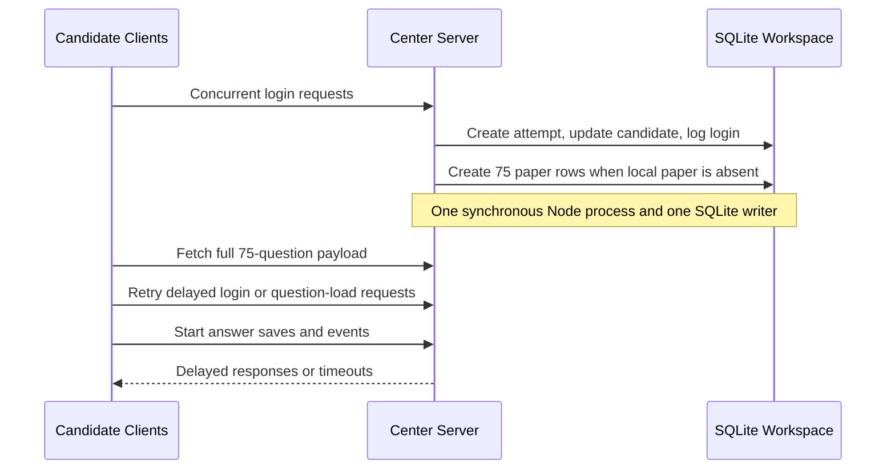

# Offline Center Capacity Incident Audit - 19 September 2026

**Status:** Incident audit and remediation plan

**Scope:** AlignEx Center Server, Candidate Client, local SQLite workspace, center LAN, and offline examination operations.

## 1. Incident Summary

An offline traditional exam was configured for 179 candidates with 75 questions each. Candidate papers were generated in the portal, the exam package was imported into the Center Server, and the exam opened as planned. After roughly 100 candidates connected, the Center Server became severely slow or unresponsive. Some Candidate Client installations could no longer connect and others displayed an unable-to-load-question error.

The expected paper volume was:

$$
179 \text{ candidates} \times 75 \text{ questions} = 13{,}425 \text{ paper rows}
$$

This volume is normal for a CBT sitting. It must be supported by the Center Server and must not be treated as an exceptional workload.

## 1.1 Target Capacity

The operating target for one Center Server is a maximum of **250 candidates** writing a 75-question exam. The target prepared-paper volume is:

$$
250 \text{ candidates} \times 75 \text{ questions} = 18{,}750 \text{ paper rows}
$$

This is a maximum certified capacity, not an estimate. A center may only admit up to 250 candidates after it passes the 15% backup Autoboot drill and all release criteria in Section 7 on the exact server hardware, Center Server release, Candidate Client release, and LAN design intended for the sitting.

### Supported capacity tiers and Autoboot backup

The supported live-exam capacity tiers are **15, 25, 50, 100, 150, 200, and 250 candidates**. Autoboot must test each selected capacity plus a 15% operational backup so the readiness run covers a small amount of over-capacity pressure:

$$
	ext{Autoboot clients} = \left\lceil \text{capacity} \times 1.15 \right\rceil
$$

| Live capacity | 15% backup | Autoboot target |
| ---: | ---: | ---: |
| 15 | 2.25 | 18 |
| 25 | 3.75 | 29 |
| 50 | 7.50 | 58 |
| 100 | 15.00 | 115 |
| 150 | 22.50 | 173 |
| 200 | 30.00 | 230 |
| 250 | 37.50 | 288 |

The server must round up to the next whole client. The selected capacity tier, backup percentage, calculated Autoboot target, and package version must be frozen in the readiness report. A center's live admission limit remains the selected capacity; backup clients are synthetic readiness clients and are not additional live candidates.

No forensic logs, server hardware details, network measurements, or preserved SQLite database were supplied with this report. The conclusions below are based on the inspected runtime implementation and must be confirmed with the diagnostic capture and readiness drill in this document.

## 2. Severity and Impact

**Severity:** High

**Candidate impact:** Candidates could be delayed, disconnected, or prevented from loading their assigned questions after an exam had begun.

**Operational impact:** A local-center outage can affect every candidate assigned to that center while leaving the portal and other centers healthy. The exam must not be repeated or restarted without preserving the local database and reconciling active attempts.

## 3. Confirmed Implementation Facts

The Center Server uses Electron, Express, `better-sqlite3`, and a local SQLite database. `better-sqlite3` runs database calls synchronously in the Node.js process. Long-running database work therefore blocks the process from responding to other candidate HTTP requests.

The runtime already enables SQLite WAL mode and foreign-key enforcement in [alignex-server/src/server/database.ts](../alignex-server/src/server/database.ts). WAL improves reader/writer concurrency but does not permit multiple concurrent writers.

The runtime also creates an index for `candidate_attempts.attempt_token`. The incident is not explained by a missing token index.

### 3.1 Lazy paper materialization at login

On candidate login, [candidate-login-service.ts](../alignex-server/src/server/candidate-login-service.ts) calls `ensureCandidatePaper`. In [candidate-exam-service.ts](../alignex-server/src/server/candidate-exam-service.ts), `ensurePaperForAttempt` checks whether the local attempt already has paper rows. If it does not, it reads the exam questions, creates an option order, and inserts one `candidate_papers` row for every question in a SQLite transaction.

For a 75-question paper, a first login can create 75 rows. If 100 candidates log in close together, this fallback executes approximately:

$$
100 \times 75 = 7{,}500 \text{ candidate-paper inserts}
$$

The package must therefore be verified to contain complete local papers before the exam opens. Relying on first login to build papers creates a concentrated SQLite write burst and is the leading code-level cause of this incident.

### 3.2 Login and paper-load burst

Each successful login writes the attempt state, candidate status, and an audit event. The candidate then requests a full exam payload that includes all assigned questions, options, subjects, and saved answers. Sending a full 75-question paper once is acceptable, but simultaneous login and payload requests create a CPU, JSON-serialization, disk, and LAN burst.

### 3.3 Continuous answer-save pressure

Each answer save validates the attempt, paper question, and option; inserts or updates an answer; inserts an `answer_saved` event; and performs count queries for answered and total questions. This preserves important audit evidence, but it adds durable SQLite writes throughout the sitting.

When the initial login burst has not drained, answer saves, retries, monitoring activity, and reconnects can compound the backlog. Aggressive client retries can turn a temporary delay into a sustained overload.

### 3.4 Operational uncertainty

The following facts are not yet known and must be captured in the next drill or incident investigation:

- Whether the imported package included all local `candidate_papers` rows.
- Center Server CPU, memory, disk latency, and SQLite WAL-file growth during the failure.
- LAN topology, switch capacity, Wi-Fi use, and packet loss.
- Candidate Client timeout and retry behavior.
- The exact local server version and package version.
- SQLite errors, especially `SQLITE_BUSY`, `database is locked`, disk-full, or process crashes.

## 4. Probable Failure Sequence

This is a probable sequence, not a confirmed reproduction. The readiness drill must reproduce or disprove it on the same center hardware and LAN.

## 5. Immediate Operating Controls

These controls reduce risk but do not replace the software changes in Section 6.

1. Preserve the local SQLite database, WAL file, and shared-memory file after every incident. Do not re-import or delete the live workspace before it is copied.
2. Run the Center Server on a dedicated wired computer with an SSD, at least four CPU cores, and 8 GB RAM. Use a gigabit wired switch for the server and candidate devices.
3. Do not use shared Wi-Fi as the primary exam network. Disable nonessential downloads, cloud sync, antivirus scans, and Windows updates during a sitting.
4. Admit candidates in waves of 15 to 25 with a 15 to 30 second interval until the remediation is released and capacity is proven.
5. Before opening the exam, verify that every imported candidate has a complete local paper. A 250-candidate, 75-question sitting requires 18,750 local paper rows; its Autoboot certification requires 288 synthetic clients.
6. Do not restart the Center Server solely because one client is slow. First preserve the workspace, record the time and visible error, and assess whether active attempts remain recoverable.

## 6. Remediation Strategy

### Phase 1: Remove first-login paper generation

**Goal:** Candidate login must never create a candidate paper in a live sitting.

1. During package import, materialize each candidate's assigned paper in bounded SQLite transactions.
2. Preserve the portal-assigned question and option order from the imported package. Do not re-randomize locally when the package already defines a paper.
3. Replace the first-login fallback with a verification check that returns a clear preparation error when a paper is missing.
4. Add an import-completion report containing expected and inserted candidates, papers, questions, and options.
5. Block `start exam` when any assigned candidate is missing a complete paper.

**Acceptance criterion:** A login performs no `INSERT` into `candidate_papers` and no paper-randomization work.

### Phase 2: Protect the SQLite write path

**Goal:** Keep transactions short and make overload observable.

1. Set and verify a measured SQLite `busy_timeout` during database initialization.
2. Keep WAL mode enabled and document the checkpoint policy. Checkpointing must not run as an unbounded blocking operation during peak candidate activity.
3. Use prepared statements and `INSERT ... ON CONFLICT DO UPDATE` for answer saves, replacing read-before-update where appropriate.
4. Add composite indexes validated with `EXPLAIN QUERY PLAN` for the actual runtime queries, including:
   - `candidate_attempts(exam_id, candidate_id)`
   - `candidate_papers(attempt_id, display_order)`
   - `candidate_answers(attempt_id, question_id)`
5. Keep required audit records, but batch noncritical monitoring presentation work. An audit optimization must not silently discard answer, login, submission, disqualification, or recovery evidence.

### Phase 3: Control client load

**Goal:** Avoid a synchronized retry storm and avoid repeated full-paper transfers.

1. Cache the verified exam payload locally in the Candidate Client after the first successful load.
2. Use bounded exponential retry with randomized jitter for temporary request failures. The client must show a recoverable connection state instead of retrying immediately in a tight loop.
3. Add endpoint timing and payload-size telemetry for login, paper load, answer save, submit, and reconnect.
4. Ensure question navigation uses the local cached paper and does not request all questions repeatedly.

### Phase 4: Capacity certification

**Goal:** Treat readiness as a release gate, not a manual confidence check.

1. Implement the capacity-run mode described in [center-autoboot-readiness-drill-plan.md](center-autoboot-readiness-drill-plan.md).
2. Run it on the same hardware, server release, Candidate Client release, and LAN design planned for the live sitting.
3. Test the selected capacity plus 15% backup. For the maximum tier, use 288 synthetic clients and 75 questions each, representing 21,600 prepared paper rows.
4. Include simultaneous login, staggered login, answer-save traffic, reconnects, and a full-duration stability run.
5. Store a signed readiness report with the measured hardware, network, release versions, latency percentiles, error counts, and pass/fail decision.

## 7. Capacity Release Criteria

A center is not approved for a 250-candidate, 75-question sitting until all criteria below are met in a documented 288-client drill. The same criteria apply to the other supported capacity tiers using their calculated Autoboot target.

| Measure | Required result |
| --- | --- |
| Candidate paper preparation | 100% complete before exam opening |
| Login and initial paper load | $p95 < 2$ seconds |
| Answer save | $p95 < 500$ ms; $p99 < 1$ second |
| Data durability | No lost, duplicated, or cross-candidate answers |
| SQLite errors | Zero `SQLITE_BUSY`, lock, corruption, or disk-full errors |
| Client recovery | Reconnect returns to the same attempt and saved answers |
| Server health | CPU below 70%, stable memory, and no event-loop stall under the test load |
| Completion | 100% synthetic clients can submit or produce an accounted-for failure record |

## 8. Incident Evidence Checklist

For every future outage, collect the following before performing recovery actions:

- Center Server and Candidate Client versions.
- Exam package ID, exam code, candidate count, and question count.
- Server hardware, free disk space, and network topology.
- Center Server log and Candidate Client error screenshots.
- SQLite database, matching `-wal`, and matching `-shm` files copied together.
- Start time, first-failure time, number of connected clients, and number of active attempts.
- CPU, memory, disk, and network measurements if available.
- Any `SQLITE_BUSY`, `database is locked`, timeout, or unhandled exception messages.

## 9. Decision

The current offline delivery implementation must not be certified for a 250-candidate simultaneous start until Phase 1 is implemented and the 288-client Phase 4 readiness drill passes. Staggered admission is a temporary operating control only; pre-materialized candidate papers and measured capacity are the required permanent safeguards.